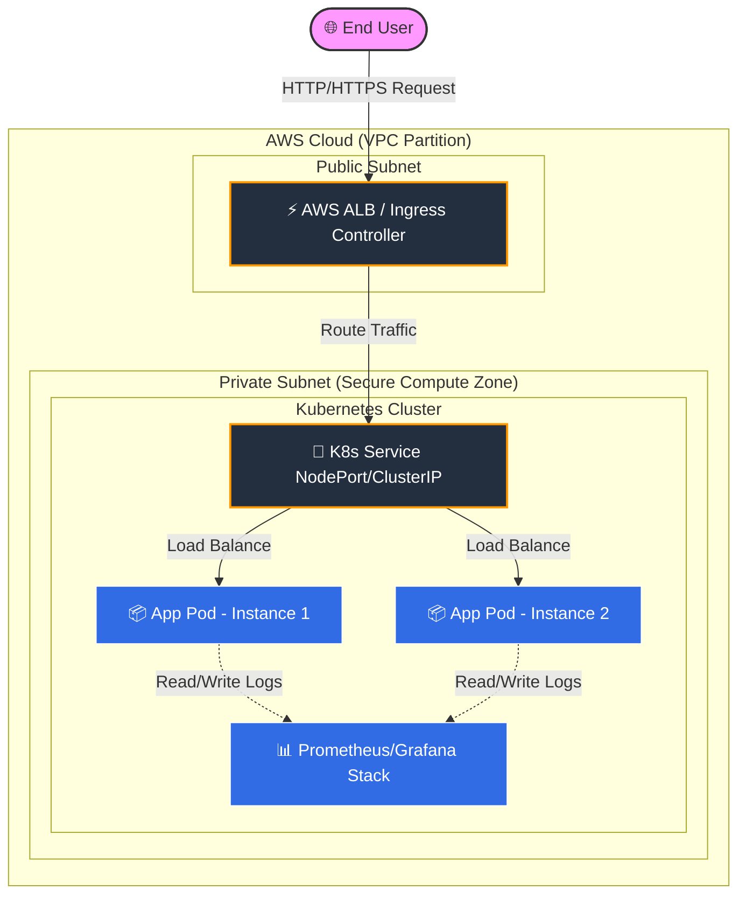

# 🚀 Kubernetes Cloud-Native Learning Lab (k8s-project-1)

<!-- Tech Stack Badges -->


---

## 📖 Project Overview

Welcome to the **Kubernetes Cloud-Native Learning Lab**! If you have ever wondered how large-scale websites stay online 24/7 without crashing, this repository holds the blueprint. 

### What is this project? (The Layman's Explanation)
Imagine you are running a busy restaurant. If you only have one chef (a single server), your kitchen will crash when hundreds of customers arrive at once. 
* **Docker** packages up our recipes neatly into standalone boxes (Containers).
* **Kubernetes (K8s)** acts as an automated Head Chef. It watches the dining room, automatically hires more cooks when it gets busy (Scaling), and immediately replaces a cook if they get sick (Self-healing).
* **Terraform** acts as our construction firm, automatically building the physical restaurant building and infrastructure in the cloud (**AWS**) using code.

This project deploys a secure, containerized application onto a cloud-managed Kubernetes cluster, showing you exactly how real-world infrastructure is built and managed safely.

---

## 🗺️ Table of Contents
* [1. Architecture Design](#1-architecture-design)
* [2. Core Learning Topics](#2-core-learning-topics)
* [3. Prerequisites](#3-prerequisites)
* [4. Getting Started & Deployment Guide](#4-getting-started--deployment-guide)
* [5. How to Use This Repo for Learning](#5-how-to-use-this-repo-for-learning)
* [6. Clean Up & Cost Optimization](#6-clean-up--cost-optimization)

---

## 1. Architecture Design

Below is a bird's-eye view of how infrastructure components communicate securely inside the Amazon Web Services (AWS) cloud network.



### Architectural Breakdown

1. **The Guarded Gateway (VPC & Subnets):** The infrastructure isolates application servers inside a **Private Subnet** so they are completely hidden from the public internet. Only safe, audited web requests passing through the public gateway can interact with them.
2. **The Smart Traffic Controller (Service & Ingress):** Requests hit a Kubernetes Service layer, which automatically distributes user traffic evenly among running application containers so no single node gets overwhelmed.

---

## 2. Core Learning Topics

By analyzing and deploying this code, you will master several foundational pillars of modern DevOps and Systems Engineering:

### 🧩 Declarative Infrastructure (Infrastructure as Code)

* **What you learn:** Instead of manually clicking buttons in the AWS Management Console to launch servers, you use **Terraform** config files.
* **Why it matters:** It prevents configuration drift and allows you to recreate an entire multi-tiered cloud environment instantly with a single command.

### ☸️ Container Orchestration & Networking

* **What you learn:** How to configure deployment manifests, specify compute resource limits, and build stable networking routing systems inside a cluster.
* **Why it matters:** This ensures your workloads remain highly available, resilient to unexpected hardware failures, and scale dynamically under heavy user demand.

---

## 3. Prerequisites

Before launching this project, ensure you have the following CLI tools installed locally:

| Tool | Purpose | Installation Link |
| --- | --- | --- |
| **AWS CLI** | Communicates securely with your cloud account | [Install AWS CLI](https://docs.aws.amazon.com/cli/latest/userguide/getting-started-install.html) |
| **Terraform** | Automates the creation of infrastructure | [Install Terraform](https://developer.hashicorp.com/terraform/tutorials/aws-get-started/install-cli) |
| **Kubectl** | The command-line tool used to control Kubernetes clusters | [Install Kubectl](https://kubernetes.io/docs/tasks/tools/) |

---

## 4. Getting Started & Deployment Guide

Follow these steps to deploy the entire learning environment onto your cloud environment.

### Step 1: Clone the Repository

```bash
git clone [https://github.com/PritamChk/k8s-project-1.git](https://github.com/PritamChk/k8s-project-1.git)
cd k8s-project-1

```

### Step 2: Initialize Cloud Infrastructure

Navigate to the Terraform folder to build your cloud networks and servers:

```bash
cd terraform
terraform init
terraform plan
terraform apply --auto-approve

```

### Step 3: Connect and Deploy Workloads

Configure your local terminal to securely access the newly generated cluster, then apply the manifest files:

```bash
aws eks update-kubeconfig --region us-east-1 --name my-k8s-cluster
cd ../k8s-manifests
kubectl apply -f deployment.yaml
kubectl apply -f service.yaml

```

### Step 4: Verify System Status

Ensure all systems are working exactly as intended:

```bash
kubectl get pods -o wide
kubectl get svc

```

---

## 5. How to Use This Repo for Learning

This repository is built specifically to serve as a practical sandbox. To fast-track your container orchestration knowledge, try completing these three practical challenges:

1. **Simulate a Failover event:** Run `kubectl delete pod <pod-name>` and watch how Kubernetes immediately spins up a brand new instance in seconds to maintain stability.
2. **Scale the Application:** Edit the `replicas: 2` line inside `deployment.yaml` to `replicas: 5` and run `kubectl apply -f deployment.yaml` to watch the cluster horizontally expand dynamically.
3. **Inspect Cluster Telemetry:** Run `kubectl logs <pod-name>` to practice tracing raw application logs and debugging common deployment runtime behaviors.

---

## 6. Clean Up & Cost Optimization

> ⚠️ **IMPORTANT NOTE:** Cloud resources cost money when left running active resources. To avoid unexpected monthly credit card charges, remember to destroy all active resources as soon as you finish your learning session.

To tear down your entire ecosystem cleanly, execute this command:

```bash
cd terraform
terraform destroy --auto-approve

```

```

```
